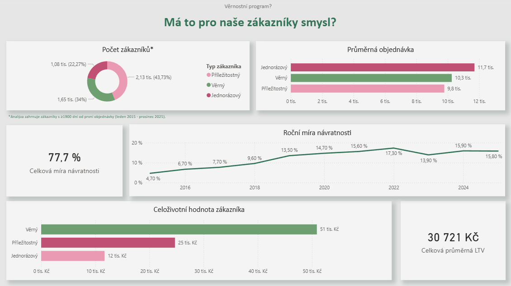
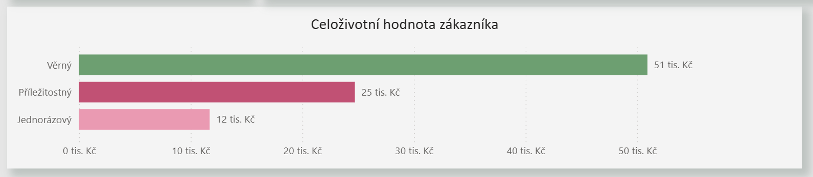
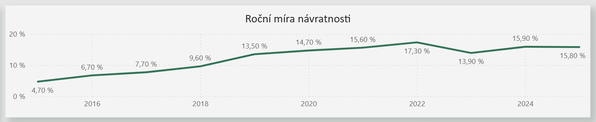

**01 Analýza návratnosti a celoživotní hodnoty zákazníků**

**"Má to pro naše zákazníky smysl?"**

**Kontext dat**

První části analýzy k věrnostnímu programu je zjištění návratnosti našich zákazníků a jejich hodnoty. 
K analýze byly použity SQL pro datové transformace, Python pro statistické testování a Power BI pro vizualizaci.

Data použitá v analýze nepředstavují kompletní dataset e-shopu, ale byla cíleně filtrována s cílem omezit časové zkreslení zákaznického chování. Segmentace zákazníků (jednorázový, příležitostný, věrný) vychází z percentilového rozdělení počtu nákupů.

Časové okno bylo nastaveno podle 50. percentilu mezi třetí a čtvrtou objednávkou, tedy v bodě, kdy se zákazník typicky posouvá z příležitostného do věrného segmentu. Tento přístup zajišťuje, že zákazníci mají reálný prostor k návratu a potenciálnímu přechodu do vyššího segmentu.

Pro ověření robustnosti je paralelně využíván i dataset s časovým horizontem odpovídajícím 75. percentilu (cca 2400 dní). Ten slouží zejména v situacích, kdy se výsledky mezi variantami významně liší, a rozšiřuje pohled o zákazníky s delším rozhodovacím cyklem.

Výsledky je i přes tato opatření nutné chápat jako zjednodušený model reality, určený primárně k demonstraci analytického přístupu (SQL, Python, Power BI) a schopnosti interpretace dat.

---

**Struktura zákazníků**

Zákaznická báze není homogenní. Největší podíl tvoří příležitostní zákazníci (43,7 %), následovaní věrnými (34,0 %) a jednorázovými (22,3 %). Významná část zákazníků se tedy nachází v přechodové fázi mezi jednorázovým a opakovaným nákupním chováním.

---

**Průměrná hodnota objednávky**

Průměrná hodnota objednávky je nejvyšší u jednorázových zákazníků (11,7 tis. Kč), zatímco věrní zákazníci dosahují nižší hodnoty (10,3 tis. Kč). Tento výsledek naznačuje, že věrnost se neprojevuje vyšší útratou v rámci jedné objednávky, ale jiným nákupním vzorcem.

---

**Celoživotní hodnota zákazníka (LTV)**

Zásadní rozdíl mezi segmenty se projeví až při pohledu na celoživotní hodnotu. Jednorázový zákazník dosahuje přibližně 12 tis. Kč, příležitostný 25 tis. Kč a věrný zákazník přibližně 51 tis. Kč. Hodnota věrného zákazníka je tak více než čtyřnásobná oproti jednorázovému, což je důsledkem opakovaných nákupů, nikoli vyšší hodnoty jednotlivých objednávek.

---

**Návratnost zákazníků**

Celková míra návratnosti dosahuje 77,7 %, což indikuje, že většina zákazníků se k nákupu vrací. Při pohledu v čase je však patrné, že tento návrat není okamžitý. V počáteční fázi (2015) se návratnost pohybovala kolem 4,7 % a postupně rostla až na současných přibližně 15–16 % ročně.

Zákazníci se tedy vracejí, ale v relativně dlouhém časovém horizontu.

**Statistické ověření**

Rozdíly mezi segmenty byly ověřeny pomocí ANOVA testu (F = 18,19; p < 0,001). Lze tedy konstatovat, že pozorované rozdíly v chování zákazníků nejsou náhodné a segmentace má oporu v datech.

---

**Interpretace**

Analýza ukazuje, že návratnost zákazníků sice existuje a v agregovaném pohledu je vysoká, avšak realizuje se v delším časovém horizontu. Přechod zákazníka do věrného segmentu není okamžitý, ale postupný proces.

Z toho vyplývá, že krátkodobě orientovaný věrnostní program s horizontem několika měsíců pravděpodobně nebude odpovídat reálnému nákupnímu cyklu zákazníků a jeho efekt bude omezený. Naopak větší smysl dává dlouhodobá práce s retencí a systematické zvyšování frekvence nákupů, zejména u příležitostných zákazníků, kteří představují klíčový potenciál pro růst.

Delší doba návratnosti je zároveň pravděpodobně ovlivněna charakterem sortimentu (háčkované, šité a pletené produkty), který má přirozeně nižší frekvenci nákupu. Tento faktor je konzistentní s pozorovaným chováním zákazníků a může indikovat, že zákazníci produkty využívají delší dobu, což nepřímo odpovídá vnímané kvalitě, i když tento závěr nelze z dostupných dat přímo potvrdit.

---

Filtr: první nákup ≥ 1900 dní před 31. 12. 2025
Období: 01/2015 – 12/2025 | N = 4 864 zákazníků
