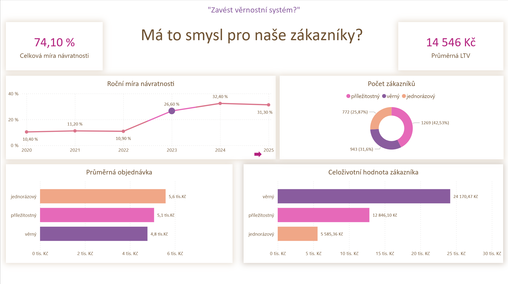
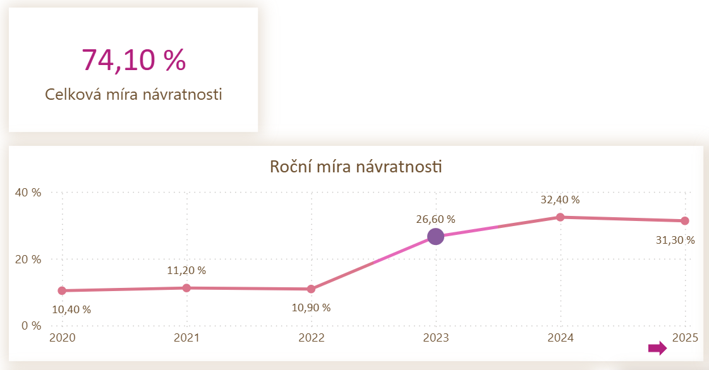
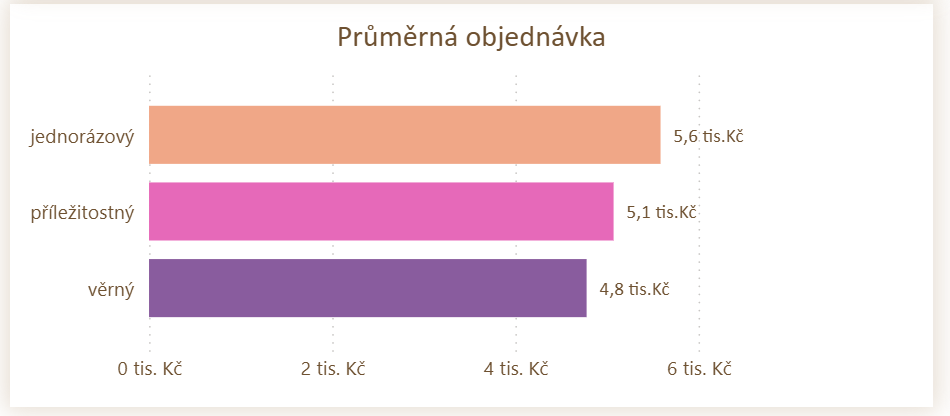
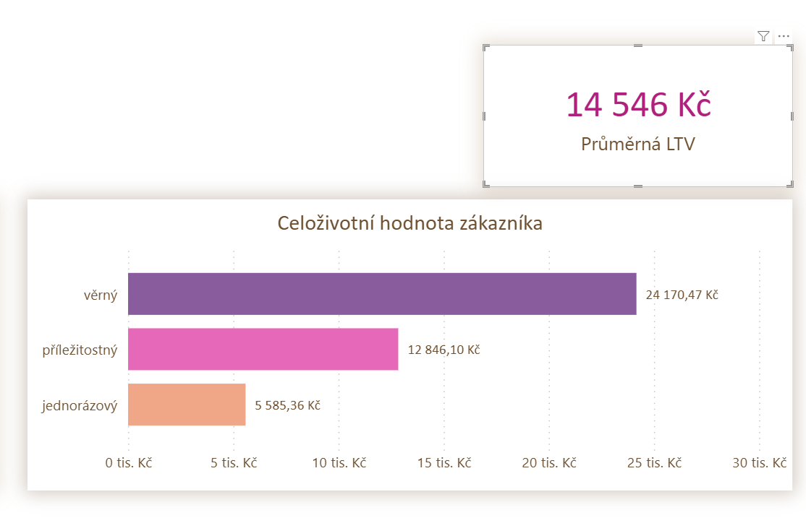
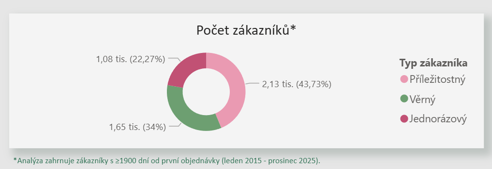

**01 Analýza návratnosti a celoživotní hodnoty zákazníků**

První části analýzy k věrnostnímu programu je zjištění návratnosti našich zákazníků a jejich hodnoty. 
K analýze byly použity SQL pro datové transformace, Python pro statistické testování a Power BI pro vizualizaci.

**Návratnost zákazníků**

Jako první jsem pomocí SQL zjistila celkovou návratnost a následně návratnost v jednotlivých letech.
Celková návratnost se ukázala být velmi vysoká - 74 %. To znamená, že tři ze čtyř zákazníků se vrací koupit znovu.
Zajímavý je však pohled na roční návratnost. V letech 2020–2022 byla velmi nízká (kolem 10 %), ale v roce 2023 výrazně vzrostla na 30 %. 
Tento skok byl nejspíše způsoben otevřením nových poboček, kterému se věnuji detailněji v části 03.

**Segmentace a ANOVA test**

Dalším krokem byl statistický test ANOVA, kterým jsem chtěla potvrdit, zda existuje rozdíl v chování zákazníků podle jejich loajality. 
Nejdřív jsem zákazníky rozdělila do tří segmentů na základě počtu jejich nákupů. Hranice intervalů nebyly určeny arbitrárně, ale podle percentilů. 
Tyto skupiny jsem poté podrobila ANOVA testu.
P-hodnota vyšla velmi nízká (prakticky nulová), což znamená, že rozdíl v jejich chování je statisticky významný.

**Průměrná objednávka — překvapivý paradox**

Očekávala bych, že věrný zákazník utratí průměrně na jednu objednávku více než jednorázový. Abych to ověřila, porovnala jsem průměry pomocí Pythonu.
Výsledek je však překvapující: jednorázový zákazník koupi v průměru na jednu objednávku nejvíce — 5 600 Kč oproti věrnému s 4 800 Kč.
Toto zjištění vedlo k další analýze celoživotní hodnoty.

**Celoživotní hodnota (LTV)**

Abych zjistila, jakou skutečnou hodnotu pro nás věrní zákazníci mají, spočítala jsem celoživotní hodnotu.
Výpočet jsem provedla pro každý segment a také pro průměrného zákazníka celkově.
Nyní je jasné, že věrný zákazník  utratí v průměru 4,3x více než jednorázový, i když jeho jednotlivé objednávky jsou menší. Vrací se totiž opakovaně.

**Počet zákazníků v každém segmentu**

Posledním důležitým ukazatelem je počet zákazníků v každém segmentu. 
Toto číslo určuje, na kterou skupinu se vyplatí zaměřit úsilí a podporovat její chování.
Výsledky ukazují, že nejvíce máme příležitostných zákazníků — těch, co koupi 2–3 krát.

