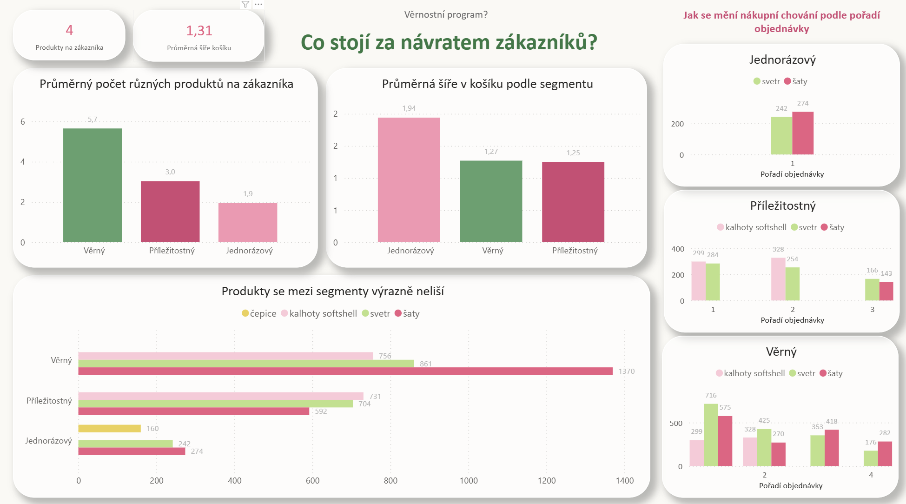
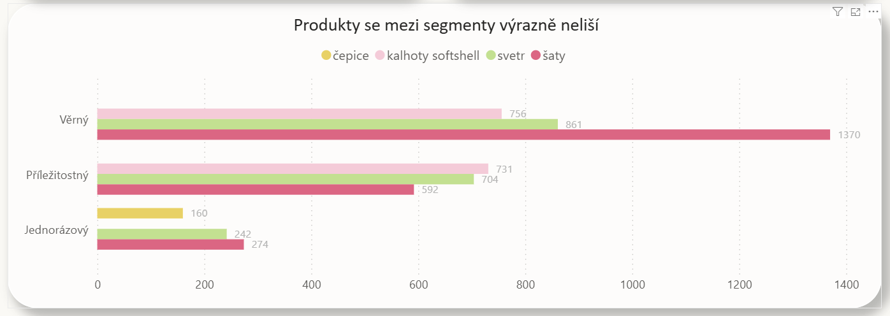

**02 Analýza produktového chování zákazníků**

**"Co stojí za návratem zákazníků?"**

**Kontext analýzy**

Druhá část analýzy věrnostního programu se zaměřuje na produktové chování zákazníků. Cílem bylo zjistit, zda existuje konkrétní produkt nebo produktová skupina, která funguje jako driver věrnosti zákazníků.

Analýza navazuje na první kapitolu zaměřenou na návratnost a celoživotní hodnotu zákazníků. Zatímco první část ukázala, že věrní zákazníci mají výrazně vyšší LTV, tato část zkoumá, zda je jejich návratnost spojena s konkrétními produkty nebo strukturou nákupu.

K analýze byly použity SQL pro datové transformace, Python pro doplňkové statistické ověření a Power BI pro vizualizaci výsledků.

Výsledky je nutné chápat jako zjednodušený model reality, určený primárně k demonstraci analytického přístupu (SQL, Python, Power BI) a schopnosti interpretace dat.

**Produkty se mezi segmenty výrazně neliší**

Nejprodávanější produkty jsou napříč segmenty velmi podobné. Ve všech segmentech se opakují především šaty a svetr, případně kalhoty softshell.

Věrní zákazníci tedy nenakupují zásadně odlišné produkty než ostatní segmenty. Rozdíl se projevuje spíše v počtu a opakovanosti nákupů než v samotném typu produktu.

**Jak se mění nákupní chování podle pořadí objednávky**

Při pohledu na jednotlivé objednávky se ukazuje, že zákazníci nakupují podobné produkty už od první objednávky. Věrní zákazníci se však vracejí opakovaně a pokračují v nákupu stejných produktových typů i ve 3. a 4. objednávce.

Rozdíl mezi segmenty se tedy neprojevuje v typu produktu, ale v počtu opakovaných nákupů.

**Produktová diverzita zákazníků**

Věrní zákazníci nakupují výrazně širší portfolio produktů než jednorázoví zákazníci. Průměrně nakoupí 5,65 unikátních produktů, zatímco jednorázový zákazník pouze 1,94.

Vyšší produktová diverzita je spojena s věrnějším zákaznickým chováním a naznačuje, že návratnost zákazníků souvisí spíše s dlouhodobým rozšiřováním nákupního portfolia než s jedním konkrétním produktem.

**Průměrná šíře košíku**

Průměrná objednávka obsahuje 1,31 unikátních produktů. Nejširší košík mají jednorázoví zákazníci, zatímco věrní zákazníci nakupují menší košíky, ale opakovaně.

To naznačuje, že věrnost není budována velikostí jedné objednávky, ale dlouhodobým nákupním chováním zákazníků.

**Doplňkové statistické ověření**

Doplňkové statistické ověření

Součástí kapitoly je také ad hoc statistické ověření v Pythonu (ad_hoc_kategorie_navratnost.ipynb), které vzniklo jako doplňková analýza po hlavním dashboardu.

V produktové analýze se nepodařilo identifikovat konkrétní produkt jako jednoznačný driver věrnosti zákazníků. Následně proto bylo rychle ověřeno, zda se vztah k návratnosti neprojevuje alespoň na vyšší úrovni produktových kategorií.

Pomocí χ² testu byla ověřena souvislost mezi kategorií prvního zakoupeného produktu a návratností zákazníka.

Výsledek testu ukázal statisticky významnou souvislost (χ² = 24,20; p < 0,001), doplňkové ověření síly vztahu však ukázalo pouze velmi slabý efekt (Cramér’s V = 0,071). Prakticky významný vztah mezi kategorií produktu a návratností zákazníků se tedy nepotvrdil.

Notebook slouží zároveň jako ukázka:

práce s Pythonem,
ad hoc analytického workflow,
statistického ověřování hypotéz,
a interpretace výsledků mimo hlavní dashboardingovou část projektu.

**Interpretace**

Produktová analýza neidentifikovala konkrétní produkt ani produktovou kategorii jako jednoznačný driver věrnosti zákazníků.

Rozdíly mezi zákazníky se projevují především:

v počtu opakovaných nákupů,
v šíři dlouhodobého produktového portfolia,
a v celkovém nákupním chování v čase.

Výsledky naznačují, že návratnost zákazníků není primárně řízena konkrétními produkty, ale spíše dlouhodobým vztahem zákazníka k e-shopu. Věrnostní program postavený pouze na konkrétních produktech by proto pravděpodobně neměl výrazný efekt.
