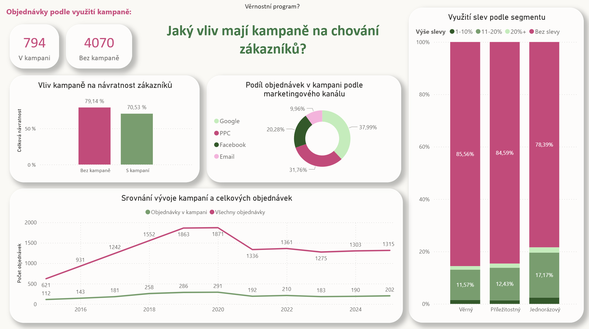
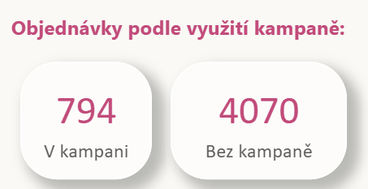
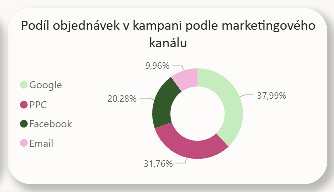
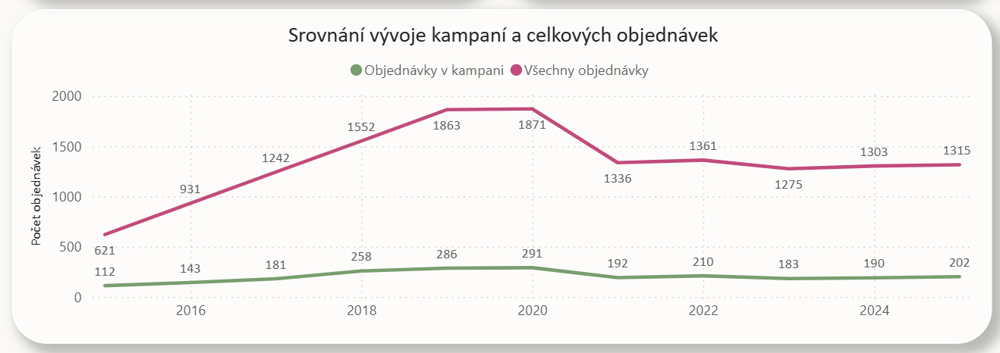

**03 Analýza vlivu kampaní na chování zákazníků**

**"Jaký vliv mají kampaně na chování zákazníků?"**

**Kontext analýzy**

Třetí část analýzy věrnostního programu se zaměřuje na marketingové kampaně a jejich vztah k návratnosti zákazníků.

Cílem bylo zjistit:

zda zákazníci získaní přes kampaně vykazují odlišné nákupní chování,
jaký podíl objednávek pochází z jednotlivých marketingových kanálů,
jak zákazníci využívají slevy,
a jak se kampaně podílejí na celkovém objemu objednávek v čase.

K analýze byly použity SQL pro datové transformace, Python pro doplňkovou AI-assisted analýzu a Power BI pro vizualizaci výsledků.

Výsledky je nutné chápat jako zjednodušený model reality, určený primárně k demonstraci analytického přístupu (SQL, Python, Power BI) a schopnosti interpretace dat.

 
 
**Vliv kampaně na návratnost zákazníků**

Zákazníci, jejichž první nákup proběhl bez kampaně, vykazují vyšší návratnost (79,14 %) než zákazníci získaní přes kampaň (70,53 %).

Výsledek naznačuje, že kampaně nejsou v tomto datasetu spojeny s vyšší dlouhodobou návratností zákazníků. Z dat však nelze vyvozovat přímý kauzální vztah mezi kampaní a nižší retencí.

**Podíl objednávek v kampani podle marketingového kanálu**

Největší podíl kampanových objednávek pochází z Google (37,99 %), následovaného PPC (31,76 %) a Facebookem (20,28 %). Email tvoří nejmenší část kampanových objednávek.

Výstup ukazuje rozložení kampanových objednávek mezi jednotlivé marketingové kanály, nikoli jejich efektivitu.

**Využití slev podle segmentu**

Ve všech segmentech převažují objednávky bez slevy. Nejvyšší podíl slevových objednávek mají jednorázoví zákazníci, zatímco věrní zákazníci využívají slevy méně často.

Výsledek naznačuje, že sleva pravděpodobně není hlavním důvodem opakovaných nákupů věrných zákazníků.

**Srovnání vývoje kampaní a celkových objednávek**

Počet kampanových objednávek se v čase vyvíjí podobně jako celkový počet objednávek. Podíl kampanových objednávek se většinu let pohybuje přibližně mezi 14–16 %.

Kampaně tedy tvoří stabilní menší část objednávek, ale nejsou hlavním zdrojem celkového objemu objednávek.

**Doplňková AI-assisted analýza v Pythonu**

Součástí kapitoly je také ad hoc analýza v Pythonu (ad_hoc_return_analysis_kampane.ipynb), zaměřená na ověření rozdílného chování zákazníků, kteří provedli první nákup v kampani a mimo ni. Chování zákazníků bylo měřeno pomocí návratnosti.

Notebook byl vytvořen pomocí AI asistenta na základě vlastního promptu a následně manuálně kontrolován z pohledu:

granularit dat,
správnosti agregací,
logiky výpočtů,
a interpretace výsledků.

Notebook je záměrně ponechán v podobě, v jaké byl AI asistentem vygenerován, jako ukázka AI-assisted analytického workflow.

**Interpretace**

Analýza ukazuje, že kampaně sice přispívají k části objednávek, ale nejsou hlavním faktorem dlouhodobé návratnosti zákazníků.

Zákazníci získaní přes kampaně vykazují nižší návratnost než zákazníci bez kampaně a zároveň se ukazuje, že věrní zákazníci využívají slevy méně často než jednorázoví zákazníci.

Výsledky naznačují, že dlouhodobá věrnost zákazníků pravděpodobně nevzniká primárně na základě slev nebo jednorázových kampaní, ale spíše díky dlouhodobému vztahu zákazníka k e-shopu a opakovanému nákupnímu chování.
