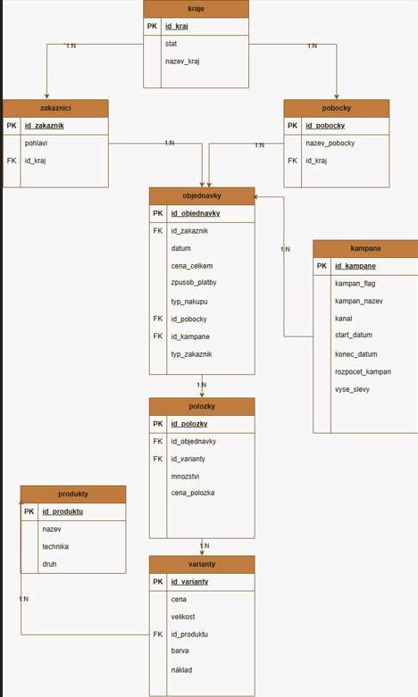

# 00 Příprava dat a datový model

Tato část projektu popisuje přípravu dat před samotnou analytickou částí. Zaměřuje se na strukturu zdrojových dat, návrh relačního modelu, ukázku tvorby tabulek v MySQL, denormalizaci dat v BigQuery a drobné úpravy v Power Query před tvorbou reportu v Power BI.

Cílem této kapitoly je ukázat, jak byla data připravena do podoby vhodné pro navazující SQL analýzy, statistické ověřování a vizualizaci výsledků.

---

## Popis dat

Projekt pracuje s fiktivním datasetem e-shopu. Data zachycují objednávky zákazníků, položky objednávek, produkty, produktové varianty, zákazníky, pobočky, kraje a marketingové kampaně.

Zdrojová data byla navržena jako sada vzájemně propojených tabulek:

| Tabulka | Popis |
|---|---|
| `zakaznici` | základní informace o zákaznících |
| `objednavky` | hlavičky objednávek |
| `polozky` | jednotlivé položky objednávek |
| `produkty` | základní produktový číselník |
| `varianty` | konkrétní varianty produktů |
| `pobocky` | číselník poboček |
| `kraje` | číselník krajů a států |
| `kampane` | informace o marketingových kampaních |

Důležitou součástí práce s daty byla granularita jednotlivých tabulek. Například tabulka `objednavky` pracuje na úrovni jedné objednávky, zatímco tabulka `polozky` pracuje na úrovni jedné položky objednávky.

---

## Relační model a ER diagram

Zdrojová data byla navržena jako relační model složený z několika vzájemně propojených tabulek. Model zachycuje základní oblasti e-commerce dat: zákazníky, objednávky, položky objednávek, produkty, produktové varianty, pobočky, kraje a marketingové kampaně.

ER diagram níže vizuálně znázorňuje hlavní tabulky, primární a cizí klíče a vztahy mezi jednotlivými entitami.

Model pracuje například se vztahy:

- jeden kraj může být přiřazen více zákazníkům a pobočkám,
- jeden zákazník může vytvořit více objednávek,
- jedna objednávka může obsahovat více položek,
- jeden produkt může mít více variant,
- jedna varianta produktu může být součástí více položek objednávek,
- jedna kampaň může být přiřazena více objednávkám.

Tento relační model sloužil jako výchozí struktura dat před následnou denormalizací v BigQuery.

---

## Tvorba tabulek v MySQL

Součástí kapitoly je zkrácená ukázka SQL skriptu pro vytvoření zdrojových tabulek v MySQL. Skript ukazuje strukturu tabulek, použité datové typy a základní vazby mezi tabulkami.

Kvůli rozsahu datasetu nejsou v repozitáři uvedeny kompletní `INSERT` příkazy, ale pouze ilustrační vzorek dat.

SQL skript:

[01_mysql_tvorba_tabulky.sql](./mysql_tabulky_a_vzorek_dat.sql)

---

## Denormalizace dat v BigQuery

Pro účely navazujících SQL analýz byl původní relační model převeden do denormalizované tabulky `denormalizovany_dataset` v BigQuery.

Výsledná tabulka pracuje na úrovni položky objednávky a spojuje informace o objednávce, zákazníkovi, produktu, variantě a kampani.

Součástí denormalizace bylo také doplnění pořadí objednávky zákazníka pomocí funkce `ROW_NUMBER()`. Po vytvoření tabulky byly provedeny kontrolní dotazy ověřující počet řádků, unikátnost položek, `NULL` hodnoty v klíčových sloupcích a správné napojení kampaní.

SQL skript:

[02_bigquery_denormalizace.sql](./02_bigquery_denormalizace.sql)

---

## Power Query úpravy v Power BI

Po načtení dat do Power BI byly v Power Query provedeny drobné úpravy zaměřené hlavně na správné zobrazení hodnot v reportu.

Jednalo se především o úpravu formátu desetinných čísel při rozdílném nastavení desetinné tečky a čárky mezi BigQuery, Power BI a lokálním prostředím. Dále byly upraveny některé textové hodnoty a popisky kategorií tak, aby byly čitelnější ve vizualizacích a legendách reportu.

Tyto úpravy neměnily analytickou logiku projektu. Sloužily hlavně ke zvýšení čitelnosti a správné interpretaci výsledků v prezentační vrstvě.
